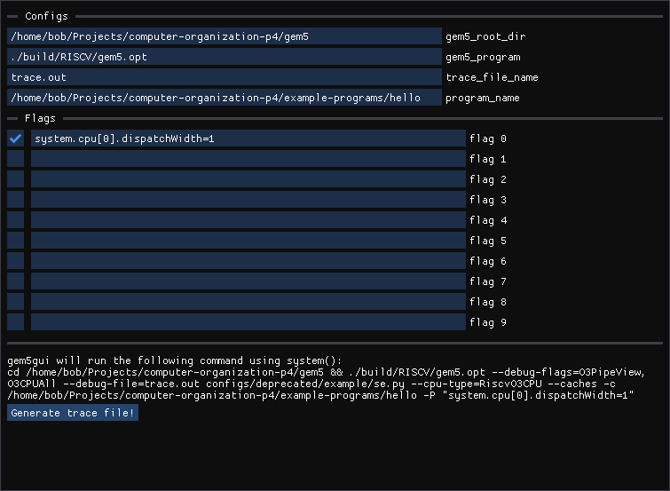

# gem5gui

幫 gem5 寫個 gui，不然打參數會花很多時間 XD

## Building gem5gui

Oh No! It seems like you'll have to figure out how to build gem5gui yourself :(

## Usage

gem5gui 使用 system() 呼叫 gem5 指令，並自動代入使用者在 gui 輸入的參數。使用前需要先將 "gem5_root_dir" 與 "program_name" 分別設置爲安裝 gem5 的根目錄 (`/` 開頭的絕對路徑)，以及想要執行的 executable 位置 (`/` 開頭的絕對路徑)，設定完成後即可按下 "Generate trace file!" 在 gem5 安裝目錄產生模擬結果。
